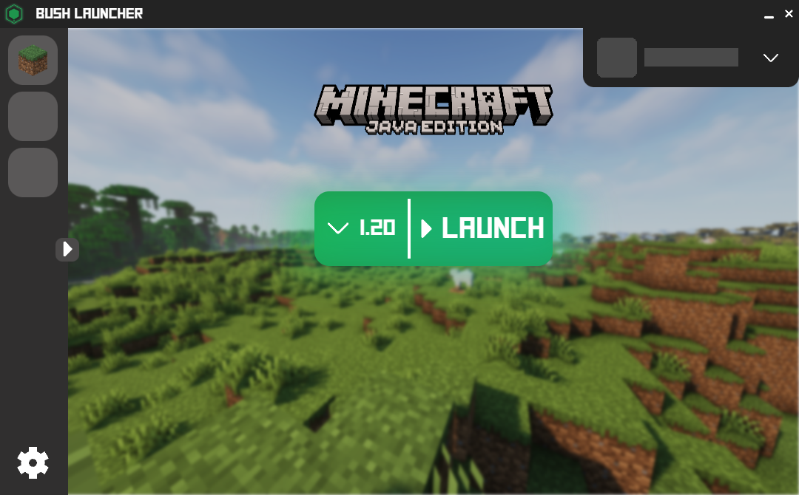
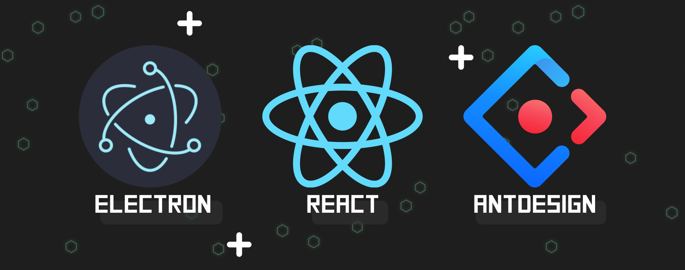

# BushLauncher &middot;    
> Playing Minecraft has never been so simple

by [@Gagafeee](https://github.com/Gagafeee) | <a href="https://github.com/Gagafeee/BushLauncher/issues">Report Bug</a>  &middot;  <a href="https://github.com/Gagafeee/BushLauncher/issues">Request Feature</a>
#

BushLauncher is a flexible Minecraft Launcher designed to simplify installation of the Minecraft game and its prerequisites, but also of mods, texture packs, etc.
#
BushLauncher uses a configuration system, you can create as many as you like and put whatever you like in : version, resourcepacks, mods, shaderpack…
[^0]
- [ ] :tired_face: Tired of always having to install stuff ?
  
    BushLauncher takes care of all,
  - [x] Java installation,
  - [x] Minecraft's installation,
  - [ ] Mods update…

- [ ] :link: Want to play with your friends ?

  BushLauncher allows you to share your configurations with your friends and play together with the same resources

- [x] :busts_in_silhouette: Have multiple accounts ?
 
  BushLauncher supports multiple minecraft accounts with a switch system

- [x] ❎ Offline mode
- [x] 📂 File Manager (manage, install and diagnose your minecraft versions)

[^0]: This projet is still under development so some features may not be available

## Built With

BushLauncher uses the power of [Electron](https://www.electronjs.org) and [React](https://legacy.reactjs.org/) to give you the best performances in any cases

## Getting Started

Download the last version of BushLauncher, login, and hit the play button !

## Contributing

- 🔍 You found a bug/error ?

    Please [open an issue](https://github.com/Gagafeee/BushLauncher/issues) and describe the bug or past the error, and specify how do you get this problem

- 🧐 You want to suggest a feature ?

     [Open an issue](https://github.com/Gagafeee/BushLauncher/issues) and describe your feature proposition
 
- 🖱️ You are a developer and you want to contribute

    MP me on discord `@Gagafeee#3431` or send me a mail at `gagafeee@gmail.com`

## Acknowledgements

* [MCHeads API](https://mc-heads.net/)
* [@XMCL](https://github.com/Voxelum/minecraft-launcher-core-node)
* [Msmc](https://github.com/Hanro50/MSMC)
